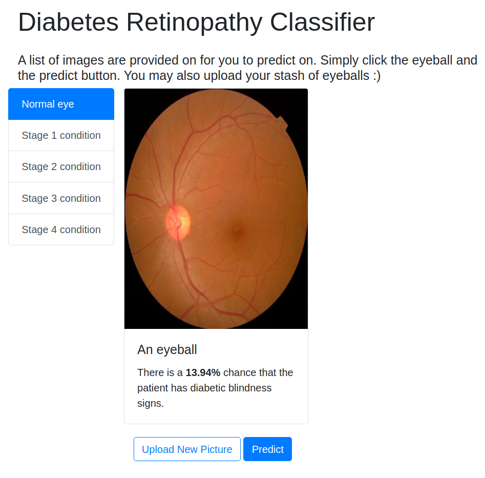

# diabetic_eye_classifier
This model is able to classify whether the eye is likely to have blindness from diabetes.
This project is based on the Kaggle APTOS 2019 Competition. View the jupyter notebook to see how the model was trained. 

## Website preview
 

## Places for improvement (to-dos)
- to make multi-class classifier for different disease stage. Due to lack of pictures, can use augmentation libraries like albumentations
- add baseline models. the mobilennet performed really well thus not much point for baseline models. But reusable baseline are really useful for assessment.
- method for splitting data can be improved, as well as the filepaths, so that the data can be used more easily for baseline models, not just tensorflow.
    - spltting data code in jupyter does not work well since it needs only be run once for permanent directories. should split code. to move out of jupyter coding pipelines as much as possible.
 

## Getting Started
- `git clone https://github.com/galenhew/diabetic_eye_classifier`
- cd into dist folder
- `python3 -m http.server`
- Open your browser to [localhost:8000](http://localhost:8000/)

## Built With

* [Tensorflow.js](https://www.tensorflow.org/js)
* [Tensorflow](https://www.tensorflow.org/)
* [Twitter Bootstrap](http://getbootstrap.com/)

## License

This project is licensed under the MIT License - see the [LICENSE.md](LICENSE.md) file for details

